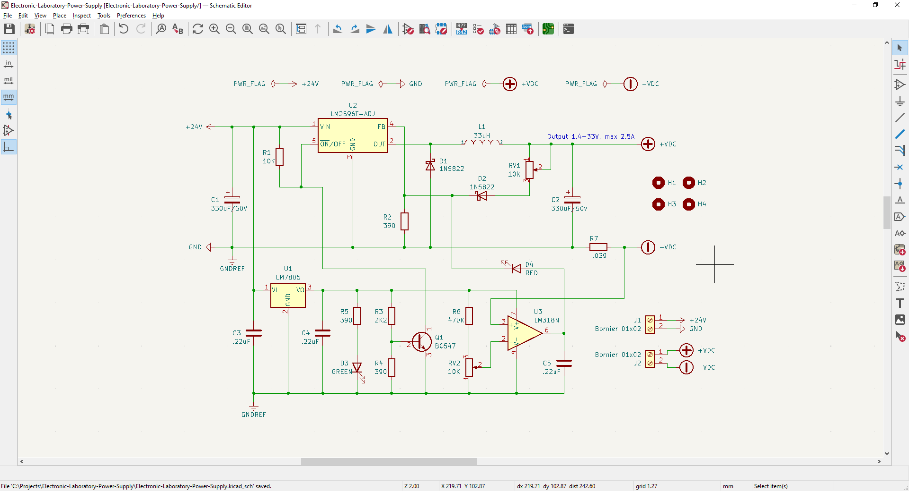
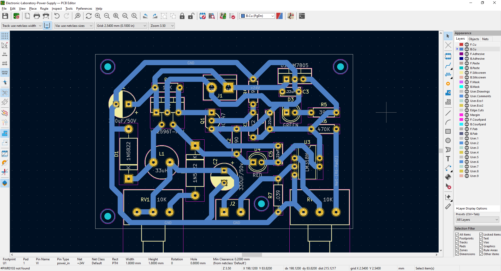
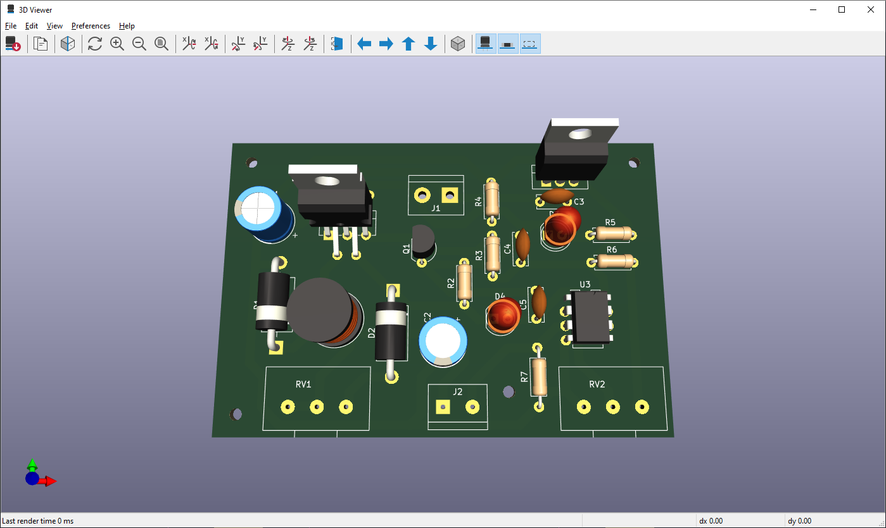
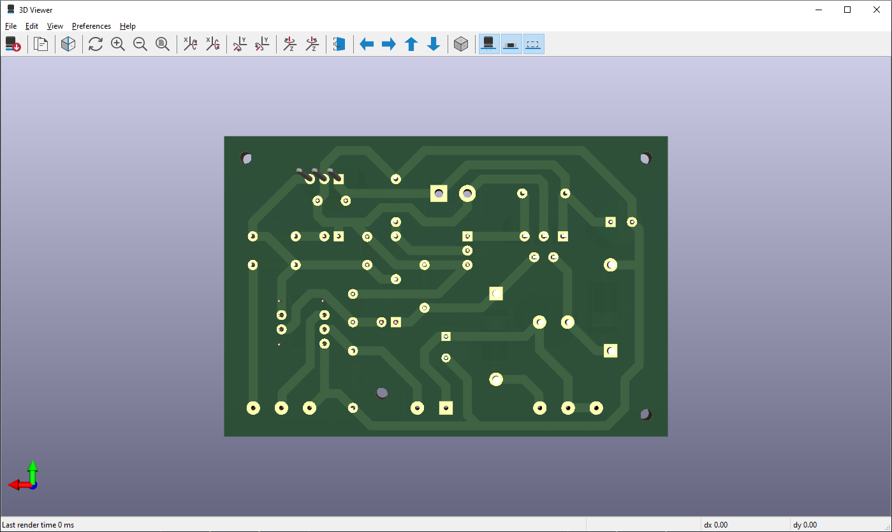

# Laboratory Power Supply Unit - LM2596 IC

Electronic adjustable laboratory power supply unit based on LM2596-ADJ IC. Output 1.4-33V, max 2.5A, with current limitation feature (Work-In-Progress).  

Based on video playlists (spanish):  
- [Fuente DC-DC variable + control de corriente](https://www.youtube.com/playlist?list=PLrgHsDQ2jwt0jt3FgAbFxksGTbsloWIvi)  
- [Fuente de laboratorio casera](https://www.youtube.com/playlist?list=PLrgHsDQ2jwt1UQQE7cqdn1-_60ikgR_oa)
both from [Proyectos LED](https://www.youtube.com/@proyectosledar) YouTube channel.

&nbsp;

This project use the following electronic components:
- 1 x LM2596-ADJ adjustable voltage regulator.
- 1 x 7805 voltage regulator.
- 1 x LM358 operational amplifier.
- 1 x Transistor BC547.
- 1 x Inductor 33uH.
- 2 x Electrolitic Capacitor 330uF/50V.
- 2 x Potenciometers B10K (lineal).
- 2 x LED 5mm (green & red)
- ...

Notes:
- 

&nbsp;

### Screenshots

| Diagram - Schematics                               | Diagram - PCB                                      |
|----------------------------------------------------|----------------------------------------------------|
|             |                   |

| Diagram - PCB Render                               | Diagram - PCB Render                               |
|----------------------------------------------------|----------------------------------------------------|
|         |          |

| Prototype                                          | PCB Manufacturing                                  |
|----------------------------------------------------|----------------------------------------------------|
|             |             |

| PCB Assembly                                       | Project Assembly                                   |
|----------------------------------------------------|----------------------------------------------------|
|             |             |

| Project Final                                      | Project Final (YouTube video)                      |
|----------------------------------------------------|----------------------------------------------------|
|             |             |

See 'Rescources' sub-folder for more pictures & videos of the project.

&nbsp;

### Version History

v1.0 (2023.06.03) - Initial release.  

&nbsp;

This source code is licensed under GPL v3.0  
Please send me your feedback about this project: andres.garcia.alves@gmail.com
